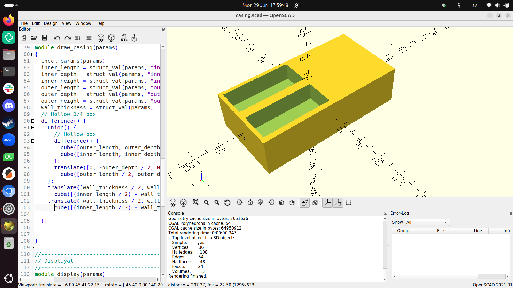

# Casing

- OpenSCAD file: [`casing.scad`](casing.scad)

I designed the casing in OpenSCAD:

<!--

I used two OpenSCAD libraries:

- [BOSL2](https://github.com/BelfrySCAD/BOSL2): to be able to use
  structures
- [text_on_OpenSCAD](https://github.com/brodykenrick/text_on_OpenSCAD):
  for the text on the machine

-->
