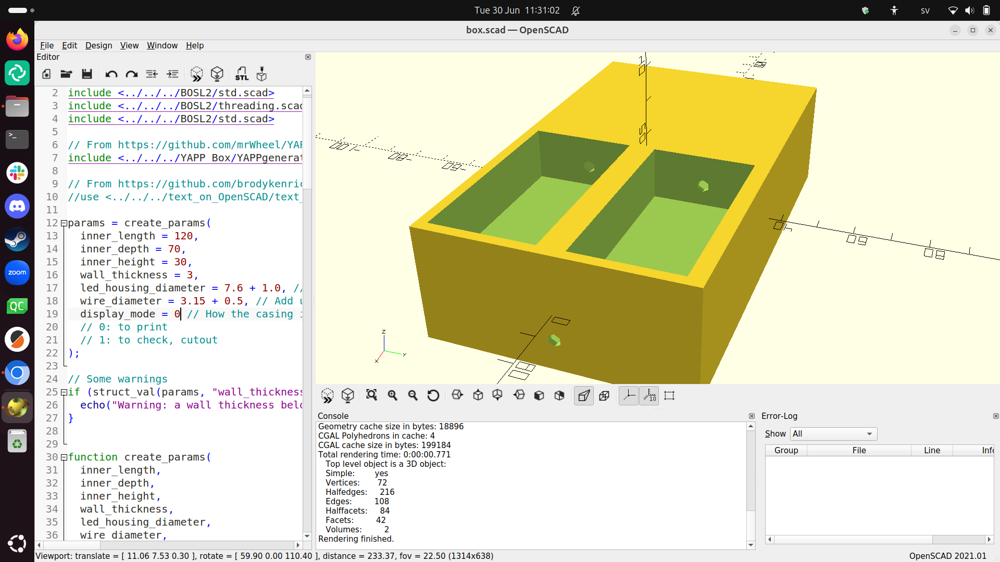
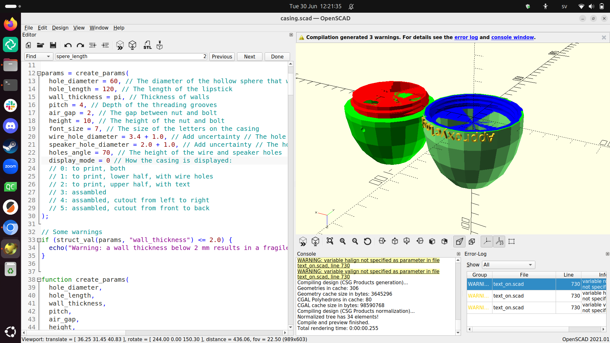

# Casing

- OpenSCAD file: [`casing.scad`](casing.scad)

I designed the casing in OpenSCAD:

<!--

I used two OpenSCAD libraries:

- [BOSL2](https://github.com/BelfrySCAD/BOSL2): to be able to use
  structures
- [text_on_OpenSCAD](https://github.com/brodykenrick/text_on_OpenSCAD):
  for the text on the machine

-->

## Box

First, I decided to go with the classical design I used before,
using a box

- OpenSCAD file: [`box.scad`](box.scad)

> box design v0.1

> box design v0.2

Then I realized, that with 3 printing, there is no need to stick to boxes:
I can be more free in the design of my casings: I can make the case round
and use a screw to connect the two parts.

I decided to call my new design the 'Lipstick' design.

## Lipstick

I started with the design of
[The Minimal Pi Clock](https://richelbilderbeek.github.io/minimal_pi_clock/)
and made its spherical design more egg shaped:

