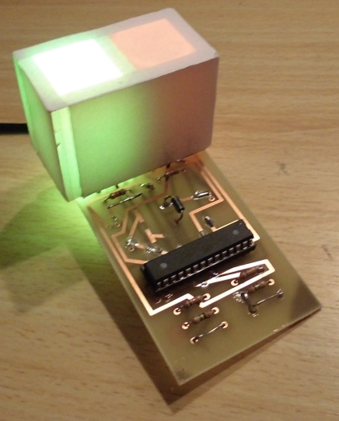
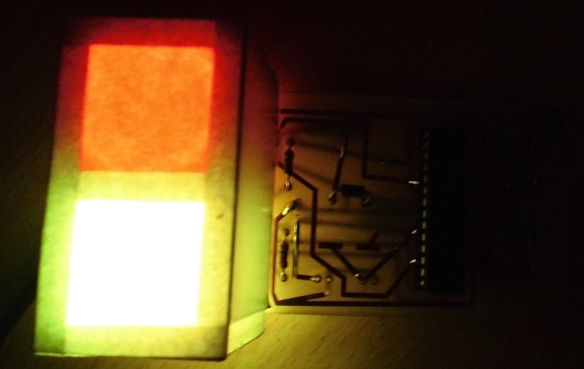
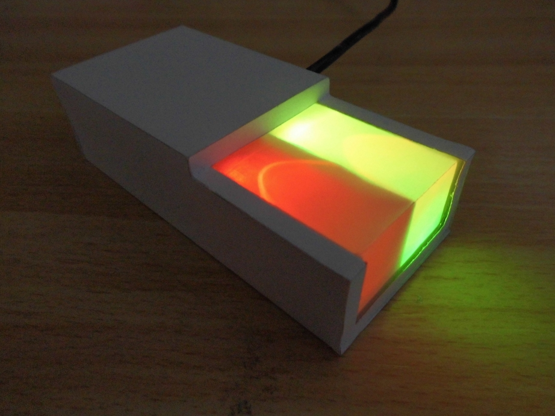
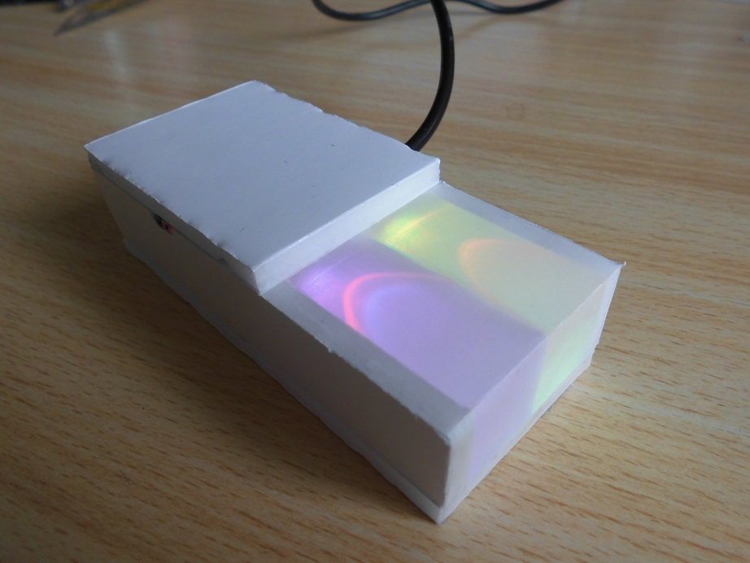
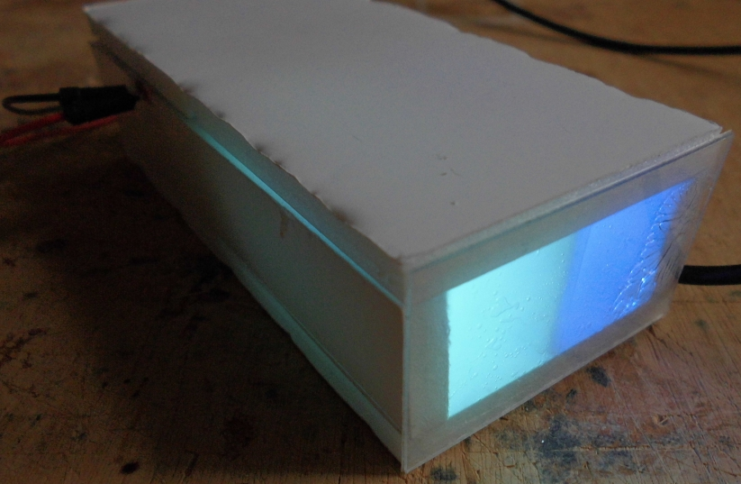
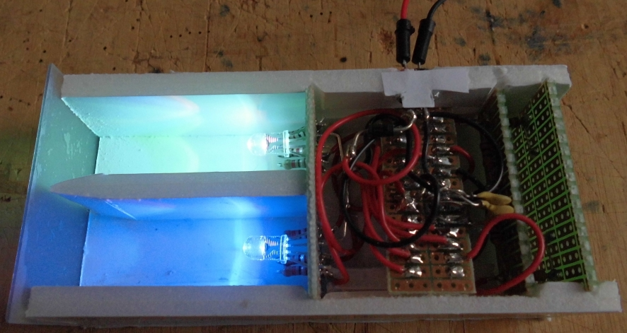
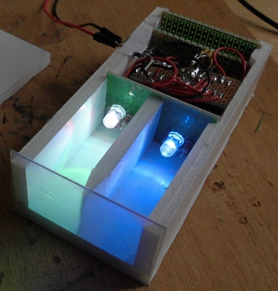
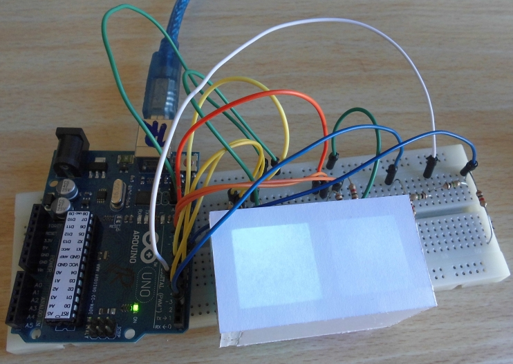
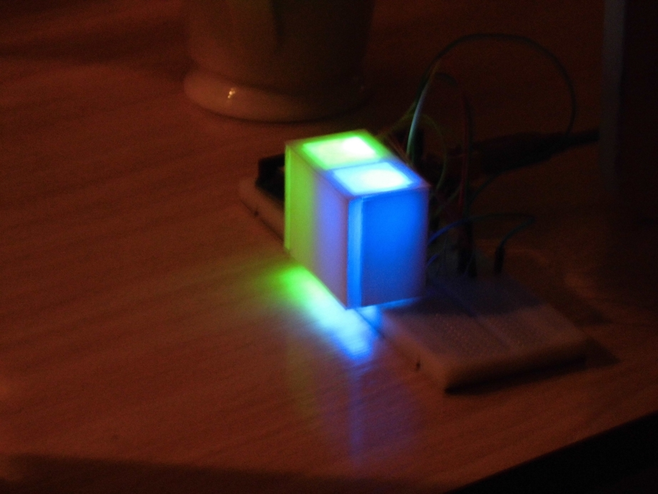
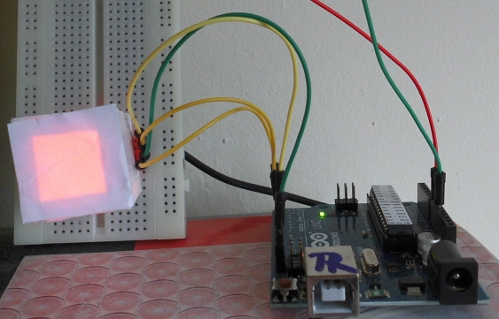

# Photos

Ordered from new to old

## 2015-04-08: Start with PCB

## 2015-04-06: Wrapped a paper casing around it

## 2015-04-06: Added an extra cut-out

## 2015-03-29: Assembled version

## 2015-03-29: Peek into inside before assemblage

## 2015-03-22: Prototype 3: Added touch sensors

## 2015-03-22: Prototype 2: Added rainbow time

## 2015-03-21: Prototype 1

